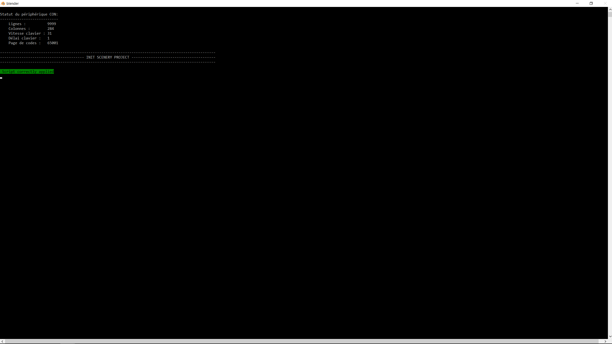

# Initialize a new MSFS scenery project

The first task when creating a new photogrammetry scenery project for [MSFS][2]{:target="_blank"} is to create the folder structure of the project.
This can be done very easily with GEDOT.
All you have to do is to select [`Google Earth Decoder Optimization Tools`](#) > [`1. Initialize a new MSFS scenery project`](#) in the GEDOT menu.

{: src='../assets/videos/initialize_scenery.mp4'}

## Setting up the project initialization

* If the path to the folder containing your [MSFS][2]{:target="_blank"} projects is not defined, click on the [path to the MSFS projects...](#){ .md-button .gedot } button.
* Indicate the name of the project in the field "Name of the project to initialize".
* Indicate the author of the project in the field "Author of the project".

!!! note annotate "Persistence of the project settings"

    Once you defined the path to the [MSFS][2]{:target="_blank"} projects, the name and the author of the project, those settings are saved. 
    The next tasks you will execute will refer to this [MSFS][2]{:target="_blank"} project, until you decide to change the name of the project, or the path to the [MSFS][2]{:target="_blank"} projects.

## Running the initialization process

When all the settings are set, the [Initialize a new MSFS project scenery...](#){ .md-button .gedot } button will be enabled (except if the [MSFS][2]{:target="_blank"} project folder already exists).
Just click on this button, and a [Blender][1]{:target="_blank"} window console will appear on the screen.

Once finished, you should see this on the console:   
{ align=center }   


A new folder, with the name or your project, is created in the folder containing all your [MSFS][2]{:target="_blank"} projects.    

An example of the folder structure of the project is presented below:   
```
Lyon1
│   Lyon1.xml
│
├───backup
├───PackageDefinitions
│   │   thalixte-lyon1.xml
│   │
│   └───thalixte-lyon1
│       │   Business.json
│       │
│       └───ContentInfo
│               Thumbnail.jpg
│
└───PackageSources
```

[1]:https://www.[Blender][1].org/
[2]:https://www.flightsimulator.com/