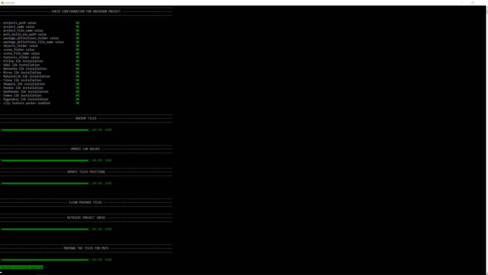

# Optimize an existing MSFS scenery project

Once the photogrammetry tiles have been retrieved, you can optimize them for MSFS using the optimization feature.

* this script optimizes an existing Google Earth Decoder scenery project (textures, Lods, CTD fix).
* if you installed and enabled the Lily Texture Packer Blender addon, and you ticked the "Bake textures enabled" checkbox in the tool menu (section PROJECT), the textures of the project are merged per tile lods, which significantly reduce the number of the project files.
* it fixes the bounding box of each tile in order for them to fit the MSFS lod management system.
* it adds Asobo extension tags in order to manage collisions, road traffic, and correct lightning.
All you have to do is to select `Google Earth Decoder Optimization Tools` > `2. Optimize an existing MFSF scenery project` in the top menu.

{: src='../assets/videos/arcachon/optimize_scenery.mp4' .md-video}

## Set up the project optimization

* if necessary, select the path to the folder containing your [MSFS][2] scenery project, by clicking on the [path to the MSFS projects...](javascript:void(0)){ .md-button .gedot } button.     
* (optional) indicate the author of the project in the field `Author of the project`.
* (optional) indicate the number of parallel [Blender][1] tasks in the field `Number of parallel Blender tasks` (by default, 4).
!!! warning annotate "Number of parallel Blender tasks"

    The more the number of parallel [Blender][1] tasks, the more CPU, GPU and memory resources needed.   

* (optional) if you have purchased the [Lily texture packer Blender addon][3] (which i strongly recommend), you can enable the texture baking by ticking the `Bake textures enabled` checkbox.

!!! question "What is texture baking ?"

    Here, texture baking is the process of merging all the textures of a 3D object into one single texture, respecting the UV map of the 3D object corresponding to the photogrammetry tile.
    It can reduce by a factor of 10 the number of textures of the MSFS scenery project, reducing the CPU cost of your scenery by decreasing the number of I/O operations.

## Run the optimization process

If all the settings are correctly set, the [Optimize an existing MSFS project scenery...](javascript:void(0)){ .md-button .gedot } button should be  enabled (except if the [MSFS][2] project folder does not exist, has been renamed or removed).  
Just click on this button, and a [Blender][1] window console will appear on the screen.

Once finished, you should see this on the console:   
{ align=center }   

By default, the building process is executed by the MSFS fspackagetool exe. At the end of the process, you shoud see this window:


In MSFS, the resulting tiles after the optimization process are presented here (to ease the comprehension, the tiles have been moved over the sea):


Note that the tiles that are entirely in the water have bee removed.

!!! warning annotate "Unknown tiles"
zz
    As some tiles are removed by the optimization process (for instance, tiles that are entirely in the water), 
    this can result in "unknown" tiles in the Scenery Editor window (in dev mode). Those "unknown" tiles can be safely removed from the scenery.

In your MSFS scenery folder, if you open a gltf file corresponding to a tile (which is in a json format), you should see this as the first line of the gltf:
```json
{
    "asset": {
        "generator": "Scenery optimized Khronos glTF Blender I/O v1.2.75",
        "version": "2.0",
        "extensions": {
            "ASOBO_normal_map_convention": {
                "tangent_space_convention": "DirectX"
            }
        }
    },
    "extensionsUsed": [
        "ASOBO_normal_map_convention",
        "ASOBO_tags",
        "ASOBO_material_fake_terrain",
        "ASOBO_material_day_night_switch",
        "ASOBO_asset_optimized"
    ],
```

If you look at a material definition, you should see this type of definition:
```json
    "materials": [
        {
            "doubleSided": false,
            "name": "Material_0",
            "pbrMetallicRoughness": {
                "baseColorTexture": {
                    "index": 0
                },
                "metallicFactor": 0
            },
            "extensions": {
                "ASOBO_tags": {
                    "tags": [
                        "Road",
                        "Collision"
                    ]
                },
                "ASOBO_material_day_night_switch": {
                    "enabled": true
                },
                "ASOBO_material_fake_terrain": {
                    "enabled": true
                }
            }
        },
        ...
    ]
```
As you can see, the optimization process automatically adds ASOBO extensions (road traffic, collision detection, day night switch and lightning adaptation for ground tiles)


If you purchased [Lily texture packer Blender addon][3], and enabled the texture backing, you should see that the number of textures has decreased:


```title="before"
Arcachon
└───PackageSources
    ├───modelLib
    └───texture
        21537373625050516_LOD00_0.png
        21537373625050516_LOD00_1.png
        21537373625050516_LOD00_10.png
        21537373625050516_LOD00_11.png
        21537373625050516_LOD00_12.png
        21537373625050516_LOD00_13.png
        21537373625050516_LOD00_14.png
        21537373625050516_LOD00_15.png
        21537373625050516_LOD00_16.png
        21537373625050516_LOD00_17.png
        21537373625050516_LOD00_18.png
        21537373625050516_LOD00_19.png
        21537373625050516_LOD00_2.png
        21537373625050516_LOD00_3.png
        21537373625050516_LOD00_4.png
        21537373625050516_LOD00_5.png
        21537373625050516_LOD00_6.png
        21537373625050516_LOD00_7.png
        21537373625050516_LOD00_8.png
        21537373625050516_LOD00_9.png
        21537373625050516_LOD01_0.png
        21537373625050516_LOD01_1.png
        21537373625050516_LOD01_2.png
        21537373625050516_LOD01_3.png
        21537373625050516_LOD01_4.png
        21537373625050516_LOD02_0.png
        21537373625050516_LOD02_1.png
        ...
```

```title="after"
Arcachon
└───PackageSources
    ├───modelLib
    └───texture
            21537373625050516_LOD00.png
            21537373625050516_LOD01.png
            21537373625050516_LOD02.png
        ...
```

[1]:https://www.blender.org/
[2]:https://www.flightsimulator.com/
[3]:https://eliemichel.gumroad.com/l/DFExj