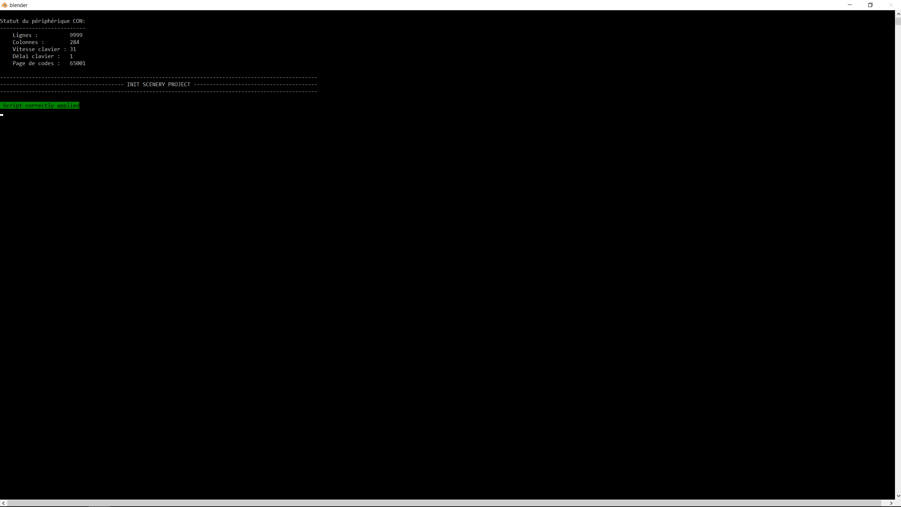

# 1. Initialize the Arcachon MSFS scenery project
{: src='../../../assets/videos/arcachon/initialize_scenery.mp4' .md-video}

Open [Blender][1], then select `Google Earth Decoder Optimization Tools` > `1. Initialize a new MSFS scenery project` in the top menu.


## Set up the project initialization

* indicate the path to the folder containing your [MSFS][2] projects by clicking on the [path to the MSFS projects...](javascript:void(0)){ .md-button .gedot } button: here ==**F:\\MSFSProjects\\**==
* indicate the name of the project in the field `Name of the project to initialize`: here ==**Arcachon**==.
* indicate the author of the project in the field `Author of the project`: here ==**Thalixte**==.
* Click on the  button to save your project settings.

## Run the initialization process

When all the settings are set, click on the [Initialize a new MSFS project scenery...](javascript:void(0)){ .md-button .gedot } button.
  
The [Blender][1] window console will appear on the screen. Once finished, you should see this on the console:   
{ align=center }   

A new Arcachon folder is created in the folder containing all the [MSFS][2] projects.    

The resulting file tree of the Arcachon project is presented below:
```
Arcachon
│   Arcachon.ini
│   Arcachon.xml
│
├───backup
├───PackageDefinitions
│   │   thalixte-arcachon.xml
│   │
│   └───thalixte-arcachon
│       │   Business.json
│       │
│       └───ContentInfo
│               Thumbnail.jpg
│
└───PackageSources
```

[1]:https://www.blender.org/
[2]:https://www.flightsimulator.com/