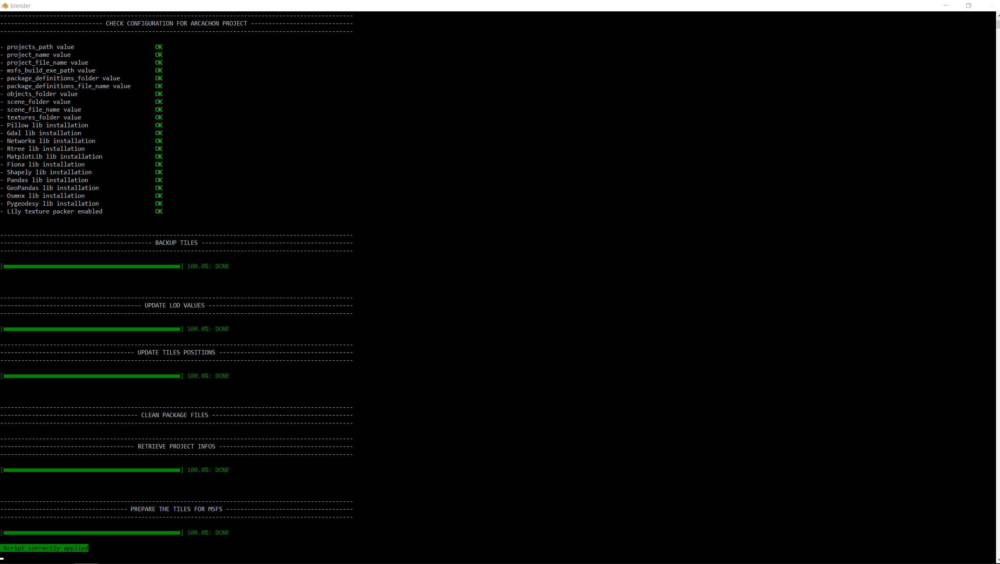

# Optimize an existing MSFS scenery project
{: src='../../../assets/videos/arcachon/optimize_scenery.mp4' .md-video}

Open [Blender][1], then select `Google Earth Decoder Optimization Tools` > `2. Optimize an existing MFSF scenery project` in the top menu.


## Set up the project optimization

* check the path to the folder containing the Arcachon [MSFS][2] scenery project, in the `Path of the project` field: here ==**F:\\MSFSProjects\\**==
* check the project name, in the `Project name` field: here ==**Arcachon**==.
* check the author of the project in the `Author of the project` field: here ==**Thalixte**==.
* indicate the number of parallel [Blender][1] tasks in the in the field `Number of parallel Blender tasks`: here ==**4**==.
* the [Lily texture packer Blender addon][3] is installed, so enable the texture baking by ticking the `Bake textures enabled` checkbox.

!!! question "What is texture baking ?"

    Here, texture baking is the process of merging all the textures of a 3D object into one single texture, respecting the UV map of the 3D object corresponding to the photogrammetry tile.
    It can reduce by a factor of 10 the number of textures of the MSFS scenery project, reducing the CPU cost of your scenery by decreasing the number of I/O operations.

## Run the optimization process

If all the settings are correctly set, the [Optimize an existing MSFS project scenery...](javascript:void(0)){ .md-button .gedot } button should be enabled.  
Just click on this button, and a [Blender][1] window console will appear on the screen.

The [Blender][1] window console will appear on the screen. Once finished, you should see this on the console:   
{ align=center }   

The building process is automatically executed by the MFS fspackagetool exe. At the end of the process, you shoud see this window:


In the Arcachon MSFS scenery folder, if you open a gltf file corresponding to a tile (which is in a json format), you should see this as the first line of the gltf:
```json
{
    "asset": {
        "generator": "Scenery optimized Khronos glTF Blender I/O v1.2.75",
        "version": "2.0",
        "extensions": {
            "ASOBO_normal_map_convention": {
                "tangent_space_convention": "DirectX"
            }
        }
    },
    "extensionsUsed": [
        "ASOBO_normal_map_convention",
        "ASOBO_tags",
        "ASOBO_material_fake_terrain",
        "ASOBO_material_day_night_switch",
        "ASOBO_asset_optimized"
    ],
```

In the material definitions, ASOBO extensions (road traffic, collision detection, day night switch and lightning adaptation for ground tiles) has been added:
```json
    "materials": [
        {
            "doubleSided": false,
            "name": "Material_0",
            "pbrMetallicRoughness": {
                "baseColorTexture": {
                    "index": 0
                },
                "metallicFactor": 0
            },
            "extensions": {
                "ASOBO_tags": {
                    "tags": [
                        "Road",
                        "Collision"
                    ]
                },
                "ASOBO_material_day_night_switch": {
                    "enabled": true
                },
                "ASOBO_material_fake_terrain": {
                    "enabled": true
                }
            }
        },
        ...
    ]
```


As [Lily texture packer Blender addon][3] is installed, and the texture backing is enabled, the number of textures has decreased:


```title="before"
Arcachon
└───PackageSources
    ├───modelLib
    └───texture
        21537373625050516_LOD00_0.png
        21537373625050516_LOD00_1.png
        21537373625050516_LOD00_10.png
        21537373625050516_LOD00_11.png
        21537373625050516_LOD00_12.png
        21537373625050516_LOD00_13.png
        21537373625050516_LOD00_14.png
        21537373625050516_LOD00_15.png
        21537373625050516_LOD00_16.png
        21537373625050516_LOD00_17.png
        21537373625050516_LOD00_18.png
        21537373625050516_LOD00_19.png
        21537373625050516_LOD00_2.png
        21537373625050516_LOD00_3.png
        21537373625050516_LOD00_4.png
        21537373625050516_LOD00_5.png
        21537373625050516_LOD00_6.png
        21537373625050516_LOD00_7.png
        21537373625050516_LOD00_8.png
        21537373625050516_LOD00_9.png
        21537373625050516_LOD01_0.png
        21537373625050516_LOD01_1.png
        21537373625050516_LOD01_2.png
        21537373625050516_LOD01_3.png
        21537373625050516_LOD01_4.png
        21537373625050516_LOD02_0.png
        21537373625050516_LOD02_1.png
        ...
```

```title="after"
Arcachon
└───PackageSources
    ├───modelLib
    └───texture
            21537373625050516_LOD00.png
            21537373625050516_LOD01.png
            21537373625050516_LOD02.png
        ...
```

[1]:https://www.[Blender][1].org/
[2]:https://www.flightsimulator.com/
[3]: https://eliemichel.gumroad.com/l/DFExj